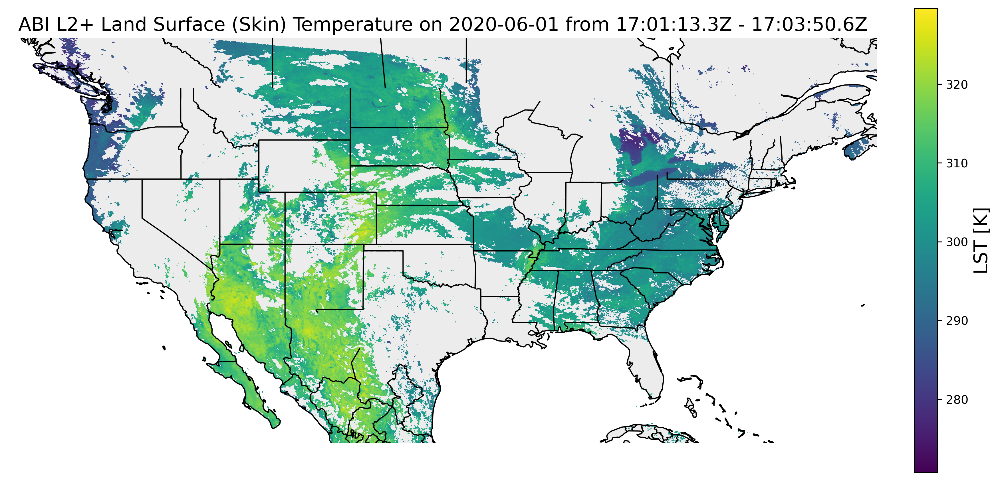
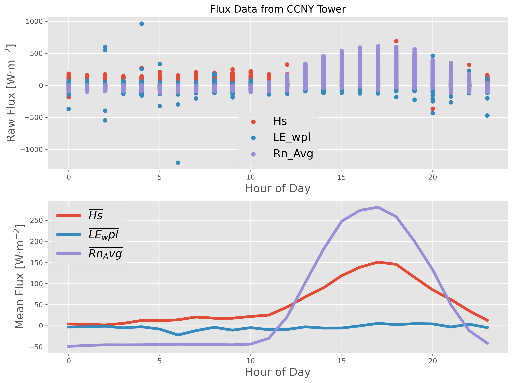
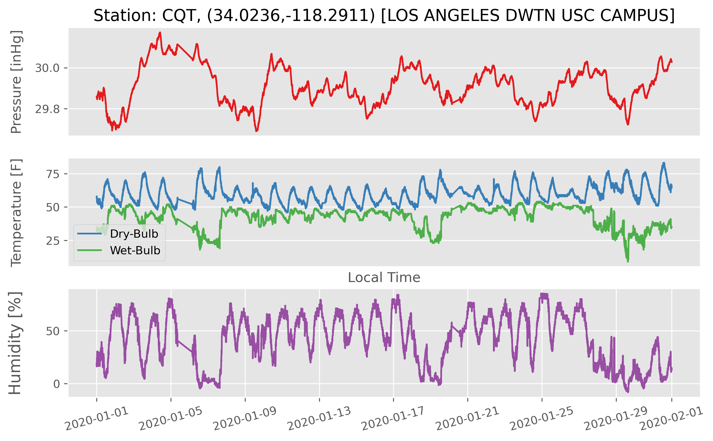
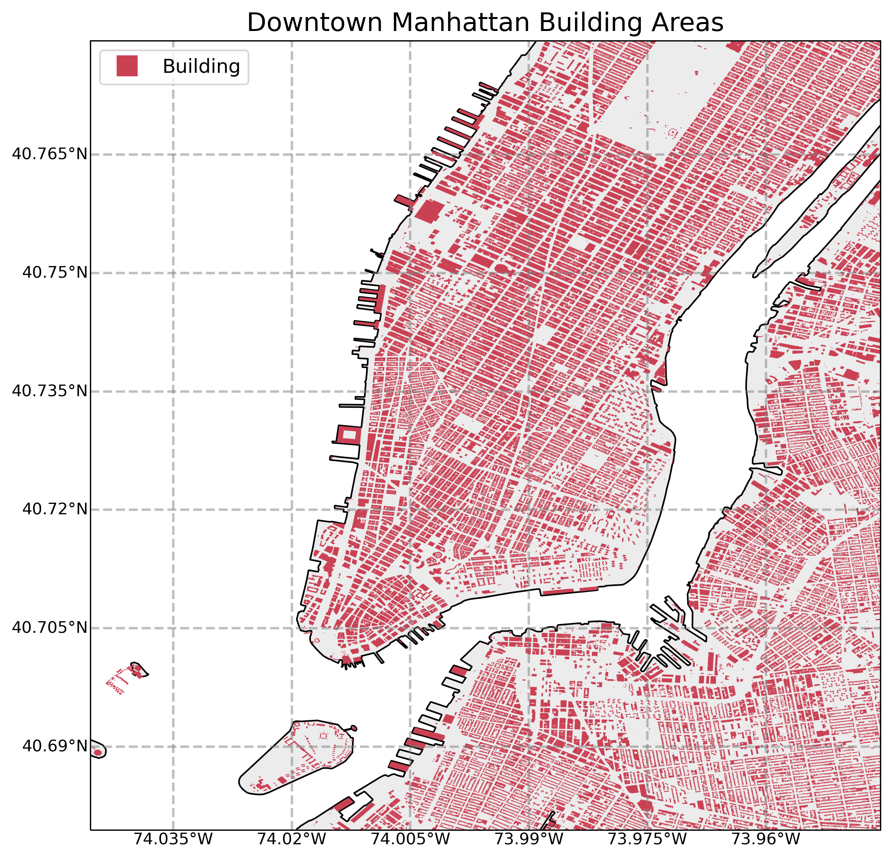
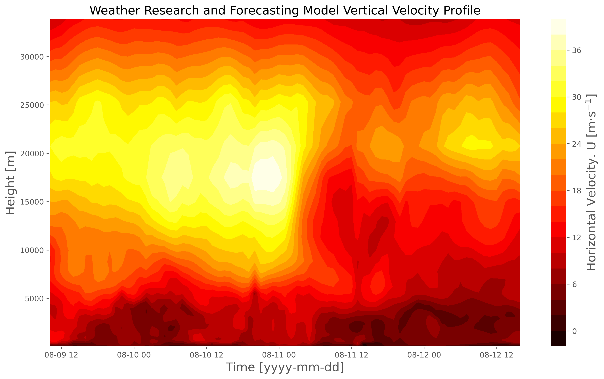

# Geospatial Analyses in Python
Python-based geospatial analysis codes related to: GOES-16 satellite data, national land cover database (NLCD), elevation maps, building footprints, city mapping across the Continental USA

## Shapefiles and Rasters
This folder contains codes that plot city shapefiles in Python using 'cartopy' 
This folder also contains codes that plot the national land cover database (NLCD) product across the USA and given cities

These codes are the backbone of the satellite analyses

*Example*:

## Geostationary Satellite
This folder contains codes that plot geostationary satellite data (GOES-16/GOES-17)

For a full tutorial on geostationary geometries, see the following tutorial:

https://makersportal.com/blog/2018/11/25/goes-r-satellite-latitude-and-longitude-grid-projection-algorithm

*Example*:

## Surface Flux Stations

This folder contains codes and data that process and visualize ground-based flux data (sensible and latent heat fluxes, net radiation, etc.)

*Example*:

## Web Scraping

This folder contains codes that scrape geospatial data using different libraries in Python. 

*Example*:

## NYC Specific

This folder uses New York City-specific analyses, particularly relating to its building footprints, ground station availibility, and numerical model comparisons.

The NYC building footprint database is available for direct download here: https://data.cityofnewyork.us/Housing-Development/Building-Footprints/nqwf-w8eh. Keep in mind that the total uncompressed shapefile is ~2.25GB! Read the full description of building properties and how they collect building data, here: https://github.com/CityOfNewYork/nyc-geo-metadata/blob/master/Metadata/Metadata_BuildingFootprints.md

*Another Note on building footprints* - if plotting the footprints, make sure your RAM is at least 8GB, maybe more depending on the background apps running. Python will pull all the 2.25GB into memory.

*Example*:

## WRF

This folder contains information on reading data from the Weather Research and Forecasting (WRF) model

uWRF (urban weather research and forecasting) data can be found on the coastal urban environmental research group's (CUERG) website (CCNY-related) at this link: https://cuerg.ccny.cuny.edu/new-york-forecast/

*Example*:

